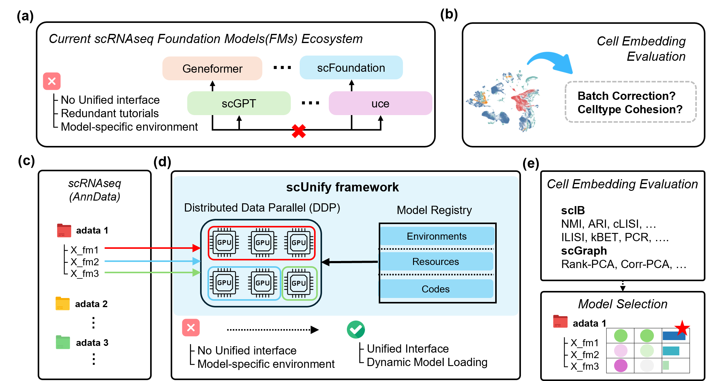

# scUnify

**A unified zero-shot inference pipeline for single-cell foundation models**

<p align="center">
  
</p>

scUnify enables multiple single-cell RNA-seq foundation models (FMs) to be executed within a single framework. Users provide a standard AnnData object; model-specific environment setup, preprocessing, and tokenization are handled automatically. The resulting embeddings are stored under model-specific keys within the same AnnData object (`adata.obsm`), enabling immediate cross-model comparison.

## Key Features

- **Registry-based modular architecture.** Model-specific implementations are decoupled from core execution logic through a standardized inferencer interface, enabling consistent integration of multiple foundation models (scGPT, scFoundation, UCE).
- **Hierarchical distributed inference.** A two-level parallelism scheme combines Ray-based inter-task scheduling with multi-GPU data-parallel inference via HuggingFace Accelerate, enabling scalable execution across large datasets.
- **Integrated embedding evaluation.** Built-in support for scIB-metrics and scGraph enables standardized comparison of bio conservation, batch correction, and cell-type structure preservation across foundation models.
- **Extensible and Jupyter-oriented design.** New FMs can be integrated through the defined inferencer interface without modifying the distributed core. Compatible with the scverse/scanpy ecosystem.

## Installation

```bash
# Core (inference pipeline)
pip install -e ".[core]"

# Evaluation module (scIB + scGraph)
pip install -e ".[eval]"
```

## Quick Start

### 1. Setup

```python
import scunify as scu

# One-time setup: download model weights, create conda envs, generate configs
scu.setup(resource_dir, config_save_dir)
```

### 2. Inference

```python
# Define tasks
tasks = [
    scu.ScUnifyConfig(adata_path, "scgpt.yaml"),
    scu.ScUnifyConfig(adata_path, "uce.yaml"),
    scu.ScUnifyConfig(adata_path, "scfoundation.yaml"),
]

# Run parallel inference
runner = scu.ScUnifyRunner(tasks, total_gpus=4, per_task_gpus=[2, 1, 1])
runner.run()  # → embeddings stored in adata.obsm and saved as .h5ad
```

### 3. Evaluation

```python
# Evaluate embeddings directly from AnnData
evaluator = scu.evaluation.Evaluator.from_adata(
    adata, batch_key="batch", label_key="cell_type"
)
results = evaluator.run_all()
evaluator.plot_results(save_dir="./results")
```

## Requirements

- Python ≥ 3.11
- Multi-GPU Linux environment
- Key dependencies: Ray (≥2.x), HuggingFace Accelerate (≥0.x), AnnData (≥0.10.x), PyTorch (≥2.0)

## Citation

If you use scUnify in your research, please cite:

```bibtex
@article{kim2025scunify,
  title={scUnify: A Unified Zero-Shot Inference Pipeline for Single-Cell Foundation Models},
  author={Kim, Donghyeon},
  year={2025},
  url={https://github.com/DHKim327/scUnify}
}
```

## License

See [LICENSE](LICENSE) for details.
